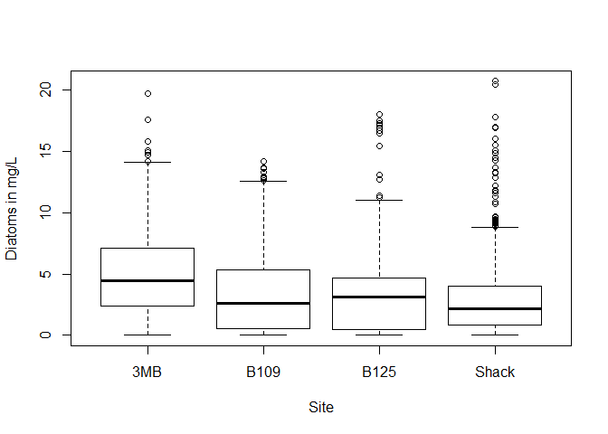
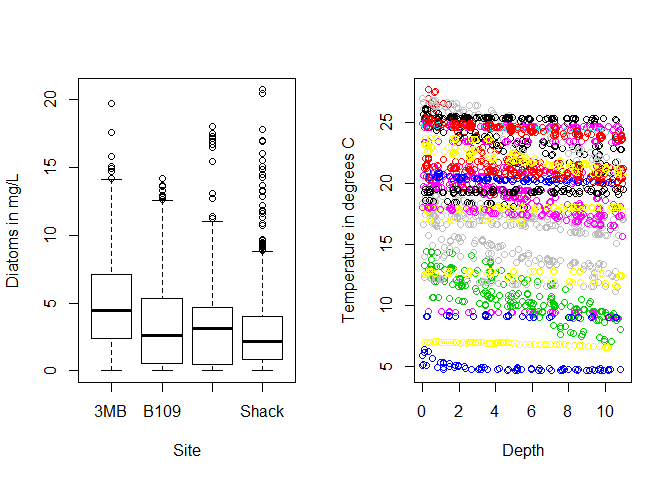
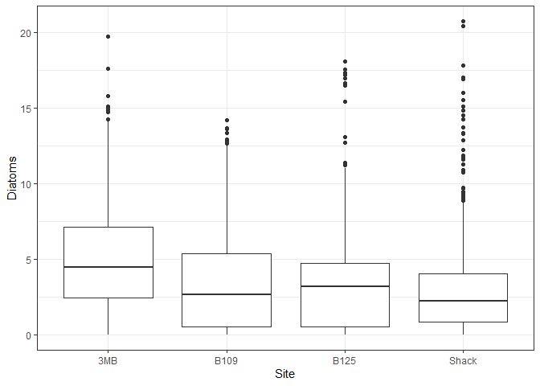
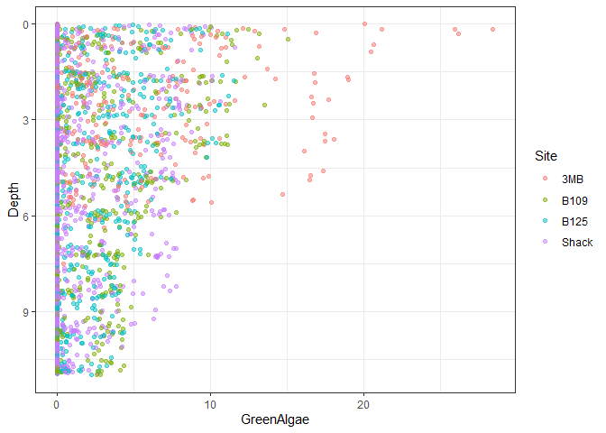
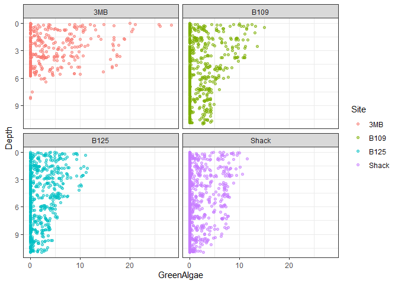
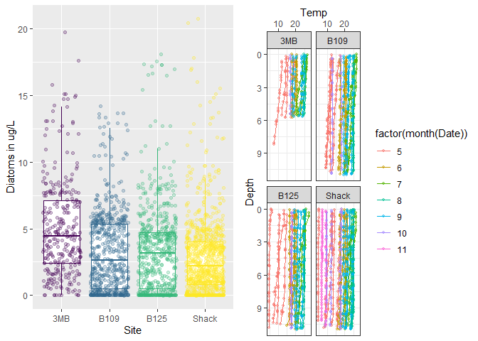
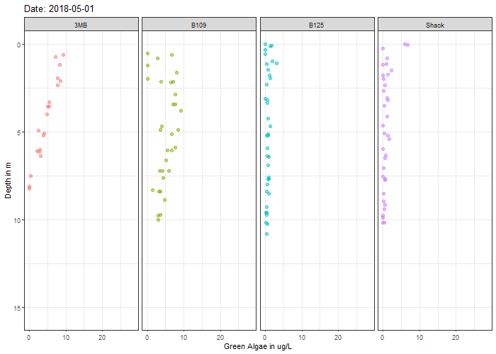

Lesson 3 - Additional Visualizations
================
Caitlin Eger
September 8, 2019

Making pretty pictures
======================

Because R is an open source software package, there are many different packages for generating graphs, maps, animations, etc. We won't be able to introduce everything during this workshop, but we want to give you enough tools to get started. Remember, a quick internet search usually turns up some helpful examples if you are struggling to get your plot to look right.

Base R images
-------------

The functions included with your basic R install are actually super flexible. It is possible to make a figure do pretty much anything using the base R plotting functions. The downside of all this flexibility is you might need to tweak your code to make a plot perfect.

Lets look at some examples using some data from Lesson 1.

### Boxplot

We'll use the fluoroprobe dataset to look at how Diatom concentrations range by site.

``` r
FLP2018 <- readRDS("data/FLP2018.Rdata")

plot(FLP2018$Site, FLP2018$Diatoms, 
     xlab = "Site",
     ylab = "Diatoms in mg/L")
```



That was pretty quick and painless! It also only scratches the surface of what these plots can do, but it can take a lot of work to learn all the functions you need.

### Boxplot and Scatterplot

Another example:

``` r
par(mfrow = c(1,2)) #this setting allows us to plot two plot windows side by side

plot(FLP2018$Site, FLP2018$Diatoms, #copy from earlier plot
     xlab = "Site",
     ylab = "Diatoms in mg/L")

plot(FLP2018$Depth, FLP2018$Temp, col = FLP2018$Date,
     xlab = "Depth",
     ylab = "Temperature in degrees C")
```



The second figure here is a depth profile, but it doesn't look like one. We'll need to change it so that depth is represented on the vertical axis

``` r
par(mfrow = c(1,2))

plot(FLP2018$Site, FLP2018$Temp, 
     xlab = "Site",
     ylab = "Temperature in degrees C")

plot(y=FLP2018$Depth, x=FLP2018$Temp, col = FLP2018$Date,
     ylab = "Depth",
     xlab = "Temperature in degrees C",
     ylim=rev(range(FLP2018$Depth)))
```


Notice the order in which you run lines of code is important, especially when creating graphics. Writing code is like writing a recipe, if we run lines of code in the wrong order, it can be like telling the computer to bake the cake before the batter is mixed. If we want to put a line, or additional points on the plot, we need to make sure everything happens in the right order.

This is a good example of where `ggplot` is a good option for some kinds of plots.

Introducing `ggplot`
--------------------

### Scatterplot

The `ggplot` library provides more tools for creating data-driven visualizations, the package takes the control of basic R graphics and makes them slightly more user friendly. It is still fairly flexible, but you do sacrifice some control for convenience. We believe this package is very useful, especially for people just starting with R.

Lets see if we can recreate plots from above, let's try the Diatom boxplot first and then the temperature depth profile again using `ggplot`.

``` r
library(ggplot2)

ggplot(FLP2018, aes(x=Site, y=Diatoms)) +
  geom_boxplot() +
  theme_bw()
```



Let's create a scatterplot that shows the concentration of Green Algae in the fluoroprobe samples by depth and site.

### Boxplot

Let's make the boxplot with Diatom concentrations a little more detailed, with overlaid jittered points.

``` r
p1 <- ggplot(data = FLP2018, aes(x = Site, y =  Diatoms, color = Site))+
  geom_boxplot(outlier.shape = NA) +
  ylab("Diatoms in ug/L")+
  geom_jitter(alpha = 0.25) +
  theme(legend.position = "none") + scale_color_viridis_d()
```

### Scatterplot

``` r
ggplot(data = FLP2018, 
       aes(x = Date, 
           y = Diatoms, 
           color = Site,
           group = Depth)) +
    geom_point(alpha = 0.25)
```


``` r
library(ggplot2)
ggplot(data = FLP2018, aes(x = GreenAlgae, y = Depth, color = Site)) +
  geom_point(alpha = 0.5) + 
  scale_y_reverse( lim=c(11, 0)) +
  theme(legend.position = "none") +
  theme_bw()
```



### Faceting

Let's use faceting to seperate the scatterplots by site

``` r
ggplot(data = FLP2018, aes(x = GreenAlgae, y = Depth, color = Site)) +
  geom_point(alpha = 0.5) + 
  scale_y_reverse( lim=c(11, 0)) +
  theme(legend.position = "none") +
  theme_bw() +
    facet_wrap( ~Site)
```



Here's another example of faceting, let's plot a timeseries to see the Diatom blooms at each site:

``` r
ggplot(data = FLP2018, 
       aes(x = Date, 
           y = Diatoms, 
           color = Site,
           group = Depth)) +
    geom_point(alpha = 0.25) +
    facet_wrap( ~ Site)
```


Now let's use faceting to look the temperature profiles

``` r
library(lubridate)
```

    ## 
    ## Attaching package: 'lubridate'

    ## The following object is masked from 'package:base':
    ## 
    ##     date

``` r
p2 <- ggplot(data = FLP2018, aes(x=Depth, y=Temp, color = factor(month(Date)), group = Date)) +
  geom_path() + 
  geom_point(alpha = 0.4, size = 1) +
  scale_x_reverse() +
  coord_flip() +
  scale_y_continuous(position = 'right') +
  facet_wrap(~Site) +
  #facet_wrap(~Site, ncol = 1) +
  theme_bw()
```

Now it looks like a depth profile, but we had to do a lot of additional coding to get it this way. Also, if you look at the dataset, the depth profile doesn't distinguish between sites - just dates! Fixing this to look at each site will require creating a separate plot for each

Now we have recreated both of these plots.

### Plotting ggplots side-by-side

``` r
library(gridExtra)
```

    ## 
    ## Attaching package: 'gridExtra'

    ## The following object is masked from 'package:dplyr':
    ## 
    ##     combine

``` r
gridExtra::grid.arrange(p1, p2, nrow=1)
```



Introducing gganimate
---------------------

``` r
#install.packages("gganimate")
library(gganimate)

anim <- ggplot(data = FLP2018, aes(x = GreenAlgae, y = Depth, color = Site)) +
  geom_point(size = 2, alpha = 0.5) + 
  facet_grid( ~Site) +
  scale_y_reverse( lim=c(15.5, 0)) +
  theme_bw() +
  labs(title = 'Date: {frame_time}', x = 'Green Algae in ug/L', y = 'Depth in m') +
  transition_time(Date) +
  ease_aes('linear') +
  shadow_mark(alpha = 0.3, size = 0.5) +
  theme(legend.position = "none")

animate(anim, duration = 15, width = 700, height = 500)
```



Introducing leaflet
-------------------

``` r
# install.packages("leaflet")
library(leaflet)

m <- leaflet() %>% #uses the pipe operator
  addTiles() %>%  # Add default OpenStreetMap map tiles
  addMarkers(lat = 50.048643, lng = 19.931288, popup = "Krakow ICE")
m
```

    ## PhantomJS not found. You can install it with webshot::install_phantomjs(). If it is installed, please make sure the phantomjs executable can be found via the PATH variable.

<!--html_preserve-->

<script type="application/json" data-for="htmlwidget-ac76ffa78012d0ed77bd">{"x":{"options":{"crs":{"crsClass":"L.CRS.EPSG3857","code":null,"proj4def":null,"projectedBounds":null,"options":{}}},"calls":[{"method":"addTiles","args":["//{s}.tile.openstreetmap.org/{z}/{x}/{y}.png",null,null,{"minZoom":0,"maxZoom":18,"tileSize":256,"subdomains":"abc","errorTileUrl":"","tms":false,"noWrap":false,"zoomOffset":0,"zoomReverse":false,"opacity":1,"zIndex":1,"detectRetina":false,"attribution":"&copy; <a href=\"http://openstreetmap.org\">OpenStreetMap<\/a> contributors, <a href=\"http://creativecommons.org/licenses/by-sa/2.0/\">CC-BY-SA<\/a>"}]},{"method":"addMarkers","args":[50.048643,19.931288,null,null,null,{"interactive":true,"draggable":false,"keyboard":true,"title":"","alt":"","zIndexOffset":0,"opacity":1,"riseOnHover":false,"riseOffset":250},"Krakow ICE",null,null,null,null,{"interactive":false,"permanent":false,"direction":"auto","opacity":1,"offset":[0,0],"textsize":"10px","textOnly":false,"className":"","sticky":true},null]}],"limits":{"lat":[50.048643,50.048643],"lng":[19.931288,19.931288]}},"evals":[],"jsHooks":[]}</script>
<!--/html_preserve-->
